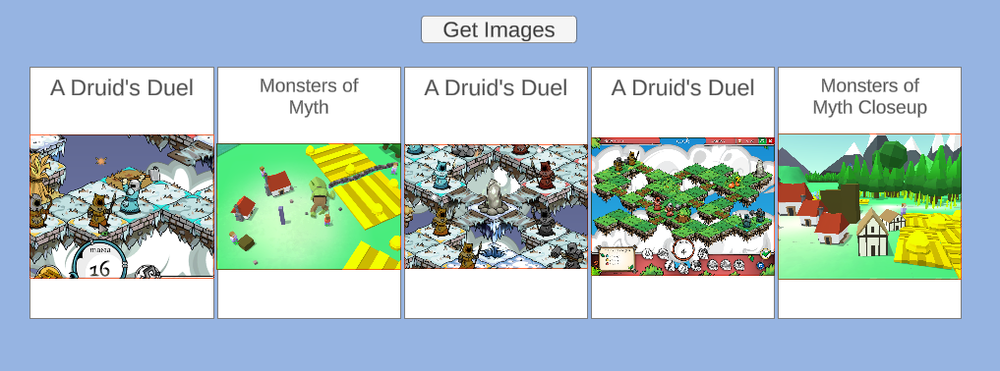

## Unity Remote Assets

Demonstrates retrieving image assets from a web server and displaying them.

The Unity app gets images from the host, creates textures, and shows them on the UI as Images/Sprites. It uses a `LayoutGroup` to arrange them evenly.

